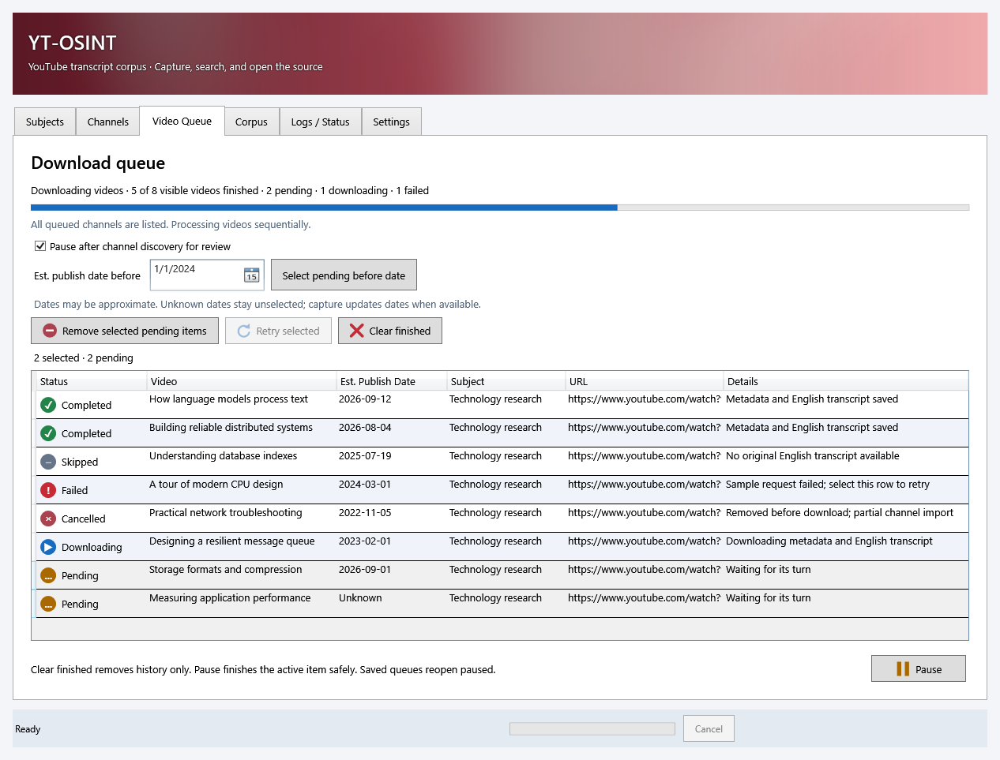
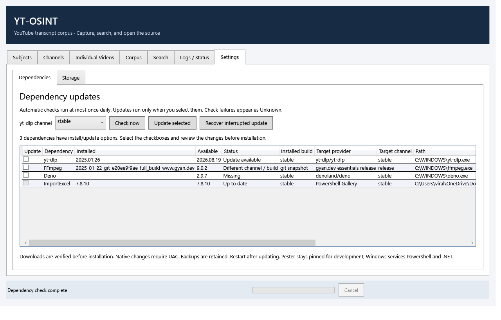

# YT-OSINT

A Windows-native PowerShell/WPF utility for collecting YouTube metadata and English transcripts into a local, searchable evidence corpus. Export a real Excel workbook, search neighboring transcript context, and open a video at the matching timestamp. No Excel installation, API key, web server, Python runtime, or database is required.

**Validation status:** deterministic fixture tests and Windows WPF startup have been exercised. Live tests against both seeded channels were attempted with the machine's preserved yt-dlp 2025.01.26; current YouTube extraction failed. A successful full-channel transcript capture and a clean-machine UAC installation have **not** been demonstrated. See [validation details](docs/VALIDATION.md).



## First launch

Use 64-bit Windows 10/11 with Windows PowerShell 5.1 and .NET Framework 4.8. Extract or clone the repository into a user-writable local folder. Start:

```powershell
.\Start-YouTubeCorpus.bat
```

Equivalent command:

```powershell
powershell.exe -NoProfile -STA -ExecutionPolicy Bypass -File .\YouTubeCorpus.ps1
```

Execution-policy bypass applies only to that process. It does not change machine policy. Organization-enforced execution restrictions still apply. The application needs network access to YouTube, GitHub releases, gyan.dev, and PowerShell Gallery during the relevant operations.

The initial subject is **Mo**, explicitly associated with `https://www.youtube.com/@atmoio` and `https://www.youtube.com/@lessbitter`. These are configuration entries, not special cases in application code. Importing is an explicit user action; startup does not sync channels.

## Dependencies and elevation

On startup a worker checks the exact paths `$env:SystemRoot\yt-dlp.exe`, `ffmpeg.exe`, and `ffprobe.exe`. Startup does not overwrite or upgrade existing executables. Explicit user-selected updates are handled separately in Settings → Dependencies. Each executable must return a valid version. A broken existing executable produces an actionable failure. The dependency page remains accessible so an explicit verified update can repair it.

Missing native binaries are installed by a separate bootstrap process elevated through UAC. The UI remains in the original user process. Rejecting UAC reports an installation failure; restart after resolving it. Once native binaries exist, startup does not request elevation again. The application does not modify PATH.

Downloads use HTTPS and upstream SHA256 manifests. yt-dlp comes from its official GitHub release. The FFmpeg essentials ZIP comes from gyan.dev, a Windows build provider linked by ffmpeg.org. Only the missing `ffmpeg.exe`/`ffprobe.exe` archive entries are extracted. File copies refuse to replace an existing destination, including a race with another installer. ARM64 Windows requires x64 emulation for these binaries.

ImportExcel is loaded if already available; otherwise the bootstrap installs it from PowerShell Gallery with `-Scope CurrentUser`. NuGet is installed in that scope if needed. Excel itself is unnecessary. Installation source, time, path, detected version, and outcome are recorded in `logs/dependencies.jsonl`. Download, extraction, and verification stages appear in the persistent bottom status bar. Bootstrap cancellation is disabled while elevated installation is in flight; closing the window waits for it to finish.

**Existing yt-dlp versions may stop working when YouTube changes.** Use Settings → Dependencies to check and explicitly update the managed executable. Do not interpret a channel extraction failure as an empty channel.

Authoritative references: [yt-dlp](https://github.com/yt-dlp/yt-dlp), [FFmpeg Windows build providers](https://ffmpeg.org/download.html), [gyan.dev releases](https://www.gyan.dev/ffmpeg/builds/), [ImportExcel](https://github.com/dfinke/ImportExcel).

## Safe dependency updates



Settings → Dependencies manages **yt-dlp**, the **FFmpeg/ffprobe pair**, **Deno**, and **ImportExcel**. Deno is the optional managed JavaScript runtime for current yt-dlp YouTube support; a missing runtime is shown as Missing and installed only when selected. Its managed location is `$env:SystemRoot\deno.exe`; unrelated runtimes elsewhere on PATH are not changed.

Startup performs background release checks at most once every 24 hours. Check now bypasses the cache. Checks fetch small upstream metadata and run local version probes; they do not download packages, request UAC, or modify installed dependencies. Network failures show **Unknown**, with the error and last-check time, and are cached for the same interval to avoid retry storms. Installed versions are re-read even when release metadata is cached. GitHub requests are unauthenticated and can be rate limited.

Select update checkboxes and press **Update selected**. A review dialog shows each installed/target version and provider. Changing yt-dlp's channel requires a new check; the preference is saved after that update succeeds. An unfamiliar or Git FFmpeg build is labeled **Different channel / build**, never numerically compared to a stable version. Selecting it explicitly replaces both binaries with the gyan.dev **essentials release** pair. A full build may have capabilities used by other applications that the essentials build does not provide. An already-newer version on the same channel is not automatically downgraded.

The update workflow:

1. Fetch the reviewed release again; if its version changed, require another check.
2. Download to local staging, verify GitHub/Gyan SHA256 or Gallery SHA512 package metadata, extract only the required native binaries, and check candidate versions. ImportExcel is tested in a fresh PowerShell process with an XLSX round-trip.
3. For native updates only, request UAC. The elevated helper re-resolves the allowlisted upstream, copies the archive into protected staging, re-verifies its digest, and writes only the fixed SystemRoot executable names. It never accepts an arbitrary destination or trusts a manifest-supplied URL/hash.
4. Preserve originals, write a durable transaction journal, replace the binaries, then verify versions and checksums. FFmpeg and ffprobe are one rollback unit. A failed replacement or verification restores the originals; unrelated selected dependencies are separate transactions.
5. For ImportExcel, install the verified version side by side in the current user's WindowsPowerShell module directory. Preserve older versions, record the previous module selection, and atomically select the verified manifest for this corpus. Existing version directories are never overwritten.
6. Log results and require an application restart before another import/build. Cancel is available during staging; replacement/rollback finishes at a safe boundary. Closing the window also waits for that boundary.

A session-wide mutex excludes other YT-OSINT imports/builds during maintenance. This does not coordinate unrelated programs using the same SystemRoot tools; Windows file-lock failures cause the update to fail safely. Replacing the pair is a journaled transaction, not a single filesystem atomic operation. After a power loss, startup blocks dependency use and Settings displays **Recovery required**. Use **Recover interrupted update** (UAC) to restore originals. Recovery refuses to overwrite files modified outside the recorded transaction and leaves a useful failure journal for manual investigation.

Backups and journals live under `$env:SystemRoot\YT-OSINT-Updates`; only Administrators/SYSTEM can change them. Result journals are readable by users. Local settings, daily cache, staging, and ImportExcel rollback information live under `data/dependencies/`. Per-run logs record sources, versions, and outcomes. Backups are retained without automatic pruning; an administrator can remove completed transaction backups after validating the new version. Do not delete pending recovery records.

Command-line equivalents (run from the repository):

```powershell
.\Update-Dependencies.ps1 -Action Check -Force
.\Update-Dependencies.ps1 -Action Check -Channel nightly -Force
.\Update-Dependencies.ps1 -Action Update -Name yt-dlp,Deno -Channel stable
.\Update-Dependencies.ps1 -Action Recover
```

The CLI Update action is itself the explicit update request. Native commits elevate only after download/staging; ImportExcel stays unelevated. Pester is a development dependency pinned to supported major versions, and Windows PowerShell/.NET remain under Windows servicing.

## Desktop workflow

1. **Subjects:** select a subject, enter its display name, and rename it, or create another subject. Add channel URLs under the selected subject. Select an association to remove it; previously captured videos, observations, and transcripts remain.
2. **Channels:** select a configured source and sync it, or sync all sources. The table shows stable IDs, counts, last attempt, last successful sync, and status. URLs resolving to the same channel ID share canonical channel state. Conflicting subject ownership is rejected while the prior association is active.
3. **Individual Videos:** paste a watch, short, or live video URL. Choose an existing subject, create/select a new subject, or leave it unassigned. Reimporting an already assigned video without choosing a subject preserves its existing assignment.
4. **Corpus:** inspect and sort video metadata. Enter a subject, channel, title, ID, or status fragment and press Filter. Build Excel regenerates the workbook from local canonical files. Open workbook uses the registered Windows application.
5. **Search:** enter literal transcript text, optionally restrict subject/channel/video and an inclusive publication-date range. Select a result to see the preceding, matching, and following segment. Double-click or press Open at timestamp to launch the browser.
6. **Logs / Status:** inspect progress, final counts, warnings, and errors; open the structured per-run log directory.
7. **Settings → Dependencies:** check releases, review installed paths and providers, choose stable/nightly for yt-dlp, select updates, or recover an interrupted update. **Settings → Storage:** inspect paths and open data/configuration. Source relationships are normally managed in Subjects. If editing JSON externally, wait until the application is idle, preserve stable IDs, and press Refresh.

Long-running work executes in a background PowerShell runspace. WPF's dispatcher timer only transfers status and completed results. External processes use asynchronous stdout/stderr readers implemented in a small C# helper loaded by PowerShell. They create no console windows and use Windows-compatible structured argument quoting. Native command logs redact URLs and do not emit signed caption URLs.

The Cancel button stops additional items and terminates an active child process tree where practical. Completed atomic commits survive. Excel cancellation is checked between rows/stages; the final EPPlus save is not interruptible mid-write. The application stays interactive and honors cancellation at the next safe boundary. Closing during work requests cancellation and waits for safe cleanup. One operation writes at a time; an exclusive file handle prevents another application instance from writing concurrently.

## Files and architecture

```text
Start-YouTubeCorpus.bat       Windows launcher
YouTubeCorpus.ps1             GUI and command-line entry point
Install-Dependencies.ps1      Missing-dependency bootstrap
Update-Dependencies.ps1       Explicit maintenance CLI and elevated native helper
Test-DependencyModule.ps1     Fresh-process module/workbook verification
config.json                  User-managed subjects and channel URLs
src/Corpus.Core.psm1          Atomic JSON, configuration, local queries
src/Corpus.YouTube.psm1       yt-dlp adapter, captures, channel/video ingestion
src/Corpus.Transcript.psm1    VTT parsing and rolling-caption normalization
src/Corpus.Excel.psm1         ImportExcel/EPPlus workbook generation
src/Corpus.Operations.psm1    Locking, run accounting, cancellation orchestration
src/Corpus.Dependencies.psm1  Release checks, caching, staging, module updates
src/Corpus.DependencyTransaction.psm1  Native pair commit, backup, rollback/recovery
src/Corpus.Process.*          Native execution and async output capture
src/Corpus.Gui.*              WPF layout and background-worker coordination
src/Corpus.Logging.psm1       JSONL logs and progress notifications
data/raw/CHANNEL/VIDEO/       Content-addressed original metadata and subtitles
data/normalized/videos/      One canonical document per video ID
data/normalized/transcripts/ Immutable transcript captures, selected by each video
data/normalized/channels/    One canonical channel state per channel ID
data/normalized/runs/        Execution records including incomplete/failed runs
output/YouTubeCorpus.xlsx     Regenerable research workbook
logs/                        Per-run JSONL and dependency logs
tests/                       Offline Pester tests and separate live test runner
```

Raw files use SHA256 content directories and stable channel/video identities, never titles. Identical downloads reuse the same file. Separate observation JSON records retain capture timestamps even when bytes do not change. Metadata snapshots preserve changing titles, descriptions, counters, names, and reported availability. Failure observations record inaccessible videos. Original metadata/subtitles are not edited during normalization.

Canonical video records reference one completed transcript snapshot. Normalized segments have deterministic SHA256 identities based on video, source, language, start/end times, and text. Repeat imports replace the canonical pointer, rather than appending duplicate Excel rows. A failed caption refresh retains the last valid transcript and marks the latest attempt failed. Atomic sibling-file replacement prevents a partially written JSON file from becoming canonical. Abandoned `Running`/`CommittingWorkbook` run records are marked `Interrupted` when the next writer obtains the lock.

VTT normalization decodes entities, removes VTT/HTML tags, joins wrapped lines, ignores blank cues and metadata blocks, and removes shared suffix/prefix words from overlapping or touching automatic cues. Manual dialogue and later intentional repetitions are retained. This is a conservative caption heuristic, not speech recognition; unusual caption editing patterns may still produce imperfect segmentation. Only English tracks with VTT renditions are imported. Raw captions remain available for auditing or future reprocessing.

## Workbook

The workbook contains **Videos**, **Transcript**, **Channels**, and **Runs**. Transcript rows include publication date, subject/channel/title, timestamp, text, source, capture time, and a genuine hyperlink such as `https://www.youtube.com/watch?v=VIDEO_ID&t=42s`. URLs round down to whole seconds. Tables support AutoFilter and Ctrl+F, freeze headers, wrap long text, and use numeric Excel date values.

Untrusted captions/titles are stored as cell values, never formulas. Excel's 32,767-character cell limit truncates display values only; full text remains local. Transcript rows beyond Excel's worksheet limit continue in `Transcript_2`, etc. An excessive Videos sheet raises a clear error. Excel builds use a temporary workbook and atomic replacement; a locked destination leaves the previous workbook intact. Every sync automatically builds the workbook, even if some items failed. If the build fails, the finalized local run record is authoritative; the previous workbook may show older run information.

Back up `config.json`, `data/`, and optionally `logs/`. Rebuild after restoring them with Build Excel; no live YouTube access is needed for export. Keep raw captures private unless you deliberately choose to share them. Git ignores all runtime corpus data, logs, and workbooks.

## Command line

```powershell
# Same ingestion implementation as the GUI
.\YouTubeCorpus.ps1 -Action SyncAll
.\YouTubeCorpus.ps1 -Action SyncChannel -Url 'https://www.youtube.com/@atmoio'
.\YouTubeCorpus.ps1 -Action Video -Url 'https://www.youtube.com/watch?v=VIDEO_ID' -SubjectId mo
.\YouTubeCorpus.ps1 -Action Build
.\YouTubeCorpus.ps1 -Action Search -Text 'search phrase'

# Bounded diagnostic import; zero means no application-imposed limit
.\YouTubeCorpus.ps1 -Action SyncChannel -Url 'https://www.youtube.com/@atmoio' -Limit 2
```

`-Root` selects a separate writable corpus directory containing a valid `config.json`. `-SkipDependencies` is for fixture tests/offline diagnostics and skips installation; required operations still need their modules/binaries. GUI cancellation is the supported graceful-cancellation path; abruptly killing a CLI process preserves completed items and leaves its running record for recovery on the next write.

## Tests

Use Windows PowerShell 5.1. The test runner supports Windows-shipped Pester 3.4 and Pester 4.10.1. ImportExcel must be available. If needed:

```powershell
Install-Module ImportExcel -Scope CurrentUser
Install-Module Pester -RequiredVersion 4.10.1 -Scope CurrentUser
.\tests\Run-Tests.ps1
```

The deterministic suite uses local metadata/VTT fixtures; it does not access YouTube or install native dependencies. It covers configuration, relationships, identifiers, parser edge cases, rolling captions, timestamp links, repeated acquisition via a mocked external adapter, raw deduplication/history, failure persistence and continuation, search context, process output, cancellation/run records, and real XLSX content/locking. GitHub Actions runs it on Windows.

Separate network integration:

```powershell
.\tests\Invoke-LiveIntegration.ps1 -Limit 2
```

This checks dependencies and syncs both configured channels twice into a new isolated temporary corpus, prints its directory, creates a workbook, and writes `integration-results.json`. Exit 2 reports live extraction failures; it is not a successful transcript acceptance result. A larger limit or `-Limit 0` can take a long time and encounter rate limits. It never downloads full video media.

A separate updater integration test downloads real releases, verifies checksums and versions, replaces native binaries **only inside a temporary test directory**, and checks the ImportExcel workbook round-trip without installing it:

```powershell
.\tests\Invoke-DependencyIntegration.ps1
```

A timed WPF startup test is also available:

```powershell
powershell.exe -NoProfile -STA -ExecutionPolicy Bypass -File .\YouTubeCorpus.ps1 -SmokeTest
```

## Troubleshooting and limits

- **No English captions:** this is an explicit unavailable status, not a parsing success. No automatic speech-to-text fallback is attempted.
- **YouTube extraction, private/deleted videos, sign-in, or rate limiting:** inspect the sanitized yt-dlp error in the run log. Retry later or review the installed yt-dlp version in Settings → Dependencies. Browser cookies and authenticated-only content are not configured by this version.
- **No videos plus extractor warnings:** treated as a channel failure; raw listing remains available when a stable channel ID was resolved.
- **Dependency failure:** the exact failing native name/path and version-check error are recorded. Existing files remain intact. This version requires successful native checks before enabling normal GUI operations.
- **Workbook locked:** close it in Excel or its viewer and build again. Raw/canonical captures survive workbook failure.
- **Insufficient disk space:** free space and retry; per-item commits remain. Temporary/staging files from a forcibly terminated process can be removed after all application instances close.
- **Very large corpora:** normalized files are read per video, but metadata/search result sets and EPPlus workbooks reside in memory. Expect increased memory use; use search filters. A database is intentionally not introduced.
- **Cancellation delay:** child processes are stopped promptly; archive download/extraction during elevated bootstrap and a final workbook serialization complete at safe boundaries. No UI-thread `DoEvents()` loop is used.
- **Full Windows acceptance remains manual:** clean-machine installation/UAC, interactive browser timestamp navigation, and a successful live full-channel caption import require validation in a suitable Windows environment. Do not equate passing offline tests with those checks.

This is an evidence retrieval utility. It does not label statements true, false, contradictory, hypocritical, or misleading.
